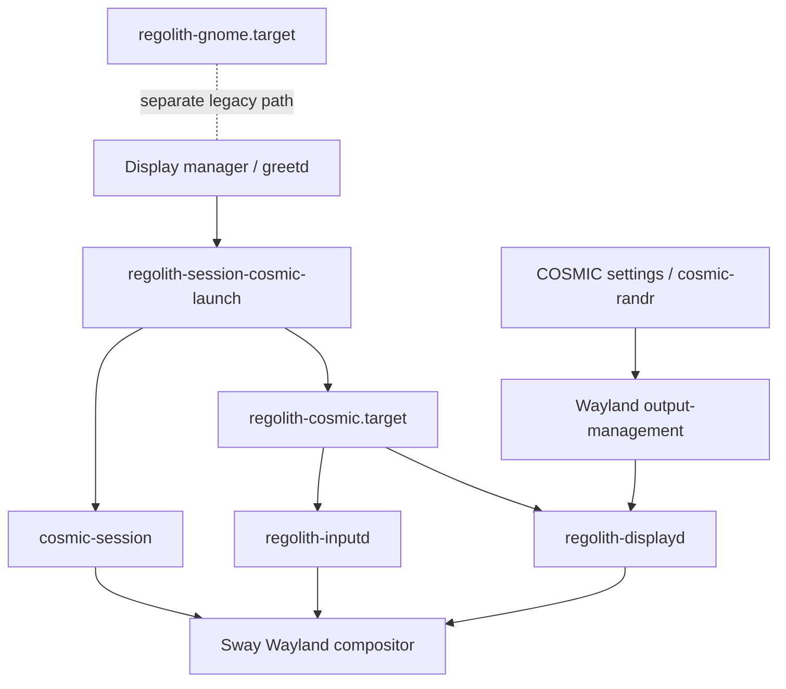

# Regolith COSMIC Session Architecture

## Executive summary

This project adapts the existing Regolith Wayland session for COSMIC while
preserving the GNOME session path. The design keeps desktop-specific behavior
behind existing component boundaries and uses separate systemd user targets to
select the active session family.

The current implementation and runtime evidence are QEMU-first. The public
proof bundle documents what is verified, what is source-only, and what remains
unavailable on the Ubuntu GNOME laptop.

## Reading paths

| Reader | Start with | Then read |
|---|---|---|
| Mentor/reviewer | [`WORK_PRODUCT.md`](WORK_PRODUCT.md) | [`FINAL_HANDOFF.md`](FINAL_HANDOFF.md) |
| Contributor | This document | [`TECHNICAL_ARTICLE.md`](TECHNICAL_ARTICLE.md) |
| Runtime verifier | [`FINAL_HANDOFF.md`](FINAL_HANDOFF.md) | dated QEMU proof notes |
| Release maintainer | [`WORK_PRODUCT.md`](WORK_PRODUCT.md) | Voulage and package proof notes |

## System boundary

The diagram describes the intended and tested Regolith boundary. It does not
claim that native COSMIC Settings persistence is complete; that boundary is
explicitly listed in the criteria table.

## Component responsibilities

### `regolith-session`

Owns session launch and systemd target composition. The COSMIC path launches
the Regolith wrapper with Sway, while the GNOME path remains available through
separate target/package ownership. The final QEMU proof observes
`cosmic-session`, Sway, the COSMIC target, and inactive GNOME target together:
see [final graphical-login proof](proof-notes/2026-08-11-final-inputd-qemu-runtime-success.md).

### `regolith-inputd`

Remains the shared input daemon. Cargo features separate GNOME and COSMIC
implementations, and runtime desktop selection uses the active desktop
environment. This follows the mentor direction to extend existing components
instead of creating a COSMIC-only replacement daemon.

Source tests cover keyboard, input-source, mouse, and touchpad mappings. The
QEMU runtime proves the installed service and representative keyboard/input
transitions; physical devices and complete reverse synchronization remain
open.

### `regolith-displayd`

Observes and reconciles display state through the Wayland output-management
path. Source tests cover output reconciliation and lifecycle cases. QEMU proof
covers the supported virtual/single-output path. Native COSMIC compositor
mutation, physical hotplug, and mixed-DPI behavior are not inferred from these
tests.

### Voulage and packages

Voulage produces the distro packages and carries the source pins and vendored
Rust build path. The tested Resolute package form uses the Regolith revision
pattern, including `-1-1regolith-resolute` where applicable. The final QEMU
tuple installed, rebooted, and passed `dpkg --audit`.

## Runtime flow

1. The display-manager/greetd boundary authenticates the user.
2. `regolith-session-cosmic-launch` starts the COSMIC-backed Regolith path.
3. `cosmic-session` starts the Sway compositor for the supported session.
4. `regolith-cosmic.target` activates the target-owned inputd and displayd
   helpers.
5. Inputd synchronizes supported COSMIC settings into Sway.
6. Displayd observes output state and handles the supported reconciliation path.
7. Sway IPC and process/environment checks provide runtime evidence.

The final QEMU proof observed `XDG_CURRENT_DESKTOP=Regolith-Wayland:COSMIC:sway`,
`WAYLAND_DISPLAY=wayland-1`, a live `SWAYSOCK`, active COSMIC/helper units,
inactive GNOME target, and empty package audit.

## Design decisions

| Decision | Rationale | Evidence/boundary |
|---|---|---|
| Extend `regolith-inputd` | Avoid maintaining a second input daemon | [canonical inputd proof](proof-notes/2026-08-11-inputd-canonical-reconciliation.md) |
| Use Cargo features | Keep GNOME and COSMIC builds selectable | inputd source/test proof |
| Select handlers at runtime | Match behavior to `XDG_CURRENT_DESKTOP` | mentor-aligned source design |
| Separate systemd targets | Keep GNOME and COSMIC lifecycle ownership distinct | [final QEMU proof](proof-notes/2026-08-11-final-inputd-qemu-runtime-success.md) |
| QEMU before hardware | Preserve rollback and repeatability | [native-host boundary](proof-notes/2026-08-11-native-cosmic-host-boundary.md) |
| Keep COSMIC PRs unmerged | Avoid upstream merge before maintainer direction | [`WORK_PRODUCT.md`](WORK_PRODUCT.md) |

## Packaging and deployment model

The reproducible deployment unit is a disposable QEMU overlay plus staged
Resolute packages. The base image is never modified by the final proof. The
public scripts document package-model and runtime-state helpers; the dated
proof notes remain authoritative for the exact private harness inputs.

There is no signed or canonical Regolith publication claim. The package
artifacts are unsigned proof artifacts and must not be treated as release
repositories.

## Verification model

- **Source:** Rust tests, shell metadata tests, formatting, and diff checks.
- **Package:** Voulage builds, package metadata, hashes, and `dpkg --audit`.
- **Runtime:** disposable QEMU cold login, process/environment checks, systemd
  target checks, Sway IPC, and representative HMP bindings.
- **Boundary:** explicit notes for native COSMIC, hardware, multimedia keys,
  signing, publication, and mentor acceptance.

## Security and operational limits

The public bundle contains no passwords, private keys, private hostnames, or
Tailscale addresses. Runtime credentials used during private QEMU runs are not
part of the reproduction guide. Native host testing was read-only; no reboot
or package installation was performed on the Ubuntu GNOME laptop.

## Glossary

- **COSMIC target:** user systemd target that owns the COSMIC session helpers.
- **GNOME target:** separate legacy session target; it is not replaced by the
  COSMIC path.
- **QEMU proof:** runtime evidence from the disposable qualification VM.
- **Voulage:** package/build workflow used for Regolith distro artifacts.
- **Sway IPC:** compositor control and observation interface used by the
  supported Regolith Wayland path.

