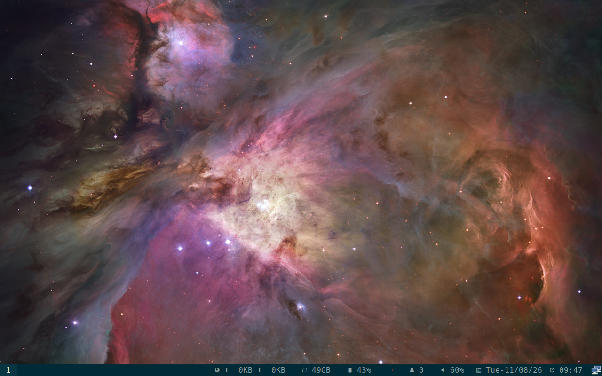

# Retained closure packet QEMU proof

Date: 2026-08-11

This is disposable snapshot-backed QEMU evidence for an older retained
closure tuple. It is separate from the newer Aug 11 source heads.

## Package and runtime result

Six Resolute amd64 packages were installed with `dpkg -i` and the command
returned exit status `0`. The guest then completed a fresh greeter login into
`cosmic-session` with Sway running under Wayland.

- `regolith-cosmic.target`: active user target
- `regolith-gnome.target`: masked and inactive user target
- `regolith-init-inputd.service`: active
- `regolith-init-displayd.service`: active
- `dpkg --audit`: empty
- no failed system units reported

The post-login framebuffer is available here:



The package names and versions were:

```text
regolith-displayd 0.3.4-1-1regolith-resolute
regolith-inputd 0.4.1-1-1regolith-resolute
regolith-session-common 1.2.0-1ubuntu1-1regolith-resolute
regolith-session-cosmic 1.2.0-1ubuntu1-1regolith-resolute
regolith-session-sway 1.2.0-1ubuntu1-1regolith-resolute
regolith-wm-config 4.11.11-1regolith-resolute
```

The VM was powered down through HMP and the QEMU process and monitor socket
were absent afterward. This does not prove the newer Aug 11 source tuple,
native `cosmic-comp`, display persistence, hardware behavior, signing, or
canonical publication.
