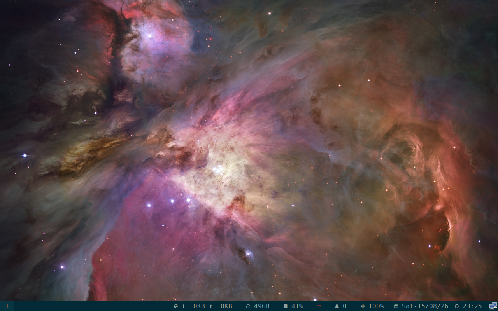

# Combined displayd/inputd/cosmolith package proof - 2026-08-15

## Result

The exact current package tuple was installed together in a disposable QEMU
copy-on-write overlay. A cold graphical login reached the COSMIC-backed
Regolith Sway session. The COSMIC helper units were active, the three target
processes were running, and Sway IPC exposed the virtual output and input
devices.

This is QEMU integration proof for the current package tuple. It does not
claim physical hardware, native `cosmic-comp`, multi-display hotplug, mixed
DPI, Settings-panel success, or canonical archive publication.

## Source and package references

- Voulage wrapper branch:
  [`rahul/voulage-displayd-lock-v4-wrapper-20260815`](https://github.com/Rahul-2k4/voulage/tree/rahul/voulage-displayd-lock-v4-wrapper-20260815)
- Voulage wrapper commit:
  [`c47fe136`](https://github.com/Rahul-2k4/voulage/commit/c47fe13634a7d6743a5a8f27435747dddd519726)
- Displayd source branch:
  [`rahul/displayd-vendor-explicit-nightly-20260812`](https://github.com/Rahul-2k4/regolith-displayd/tree/rahul/displayd-vendor-explicit-nightly-20260812)
- Displayd source commit:
  [`b79a499`](https://github.com/Rahul-2k4/regolith-displayd/commit/b79a499383a74fc6f7ae7503b0eb062a601f6fca)

Installed package tuple:

```text
regolith-displayd 0.3.4-1-1regolith-resolute
SHA-256: 89c8b5edc0ebc6387d91b766af5e0680abd016b8ed8a30fe4936c1f31c63157e

regolith-inputd 0.4.1-2-1regolith-resolute
SHA-256: 52dfaba9617f046100ae0b32392662254e5411cc8d3c7c1265c57358e1901d34

cosmolith 0.1.0-1-1regolith-resolute
SHA-256: 88755b23cf938cbd58171e71b16b0456dc882100632dd6d02226694988a95ce3
```

## Runtime observations

- `cosmic-session`, the Regolith Sway wrapper, and Sway were present after
  the cold login.
- `regolith-init-displayd.service` and `regolith-init-inputd.service` were
  `active (running)`.
- `regolith-displayd`, `regolith-inputd`, and `cosmolith` were running.
- Sway IPC reported output `Virtual-1` at `1280x800` and the QEMU keyboard,
  mouse, tablet, and power-button inputs.
- The captured desktop showed the session running with the Regolith bar and
  no configuration-error overlay.



## Build and package boundary

The personal Voulage wrapper completed vendoring, Debian source packaging, and
binary package creation after selecting nightly Cargo for the Cargo.lock v4
source and passing `-Znext-lockfile-bump` to vendoring. The build emitted
non-blocking compiler/debhelper/Lintian warnings; it did not produce a signed
archive artifact.

The package was copied into the disposable guest and installed with `dpkg -i`.
The base QEMU image was not modified. This proof does not establish upstream
Voulage publication, release signing, mentor acceptance, or a clean canonical
Trixie archive build.

## Proposal effect

This closes the previously open gap between the exact displayd package build
and combined QEMU installation/runtime. Criterion 10 remains `Partial`
because publication and release coordination are still open. Criterion 7
remains `Partial` because the persistence proof covers one input setting and
one virtual output, not the full display/settings matrix.

The strict work-product status remains **62-68%** and **4/12 criteria fully
met**.
