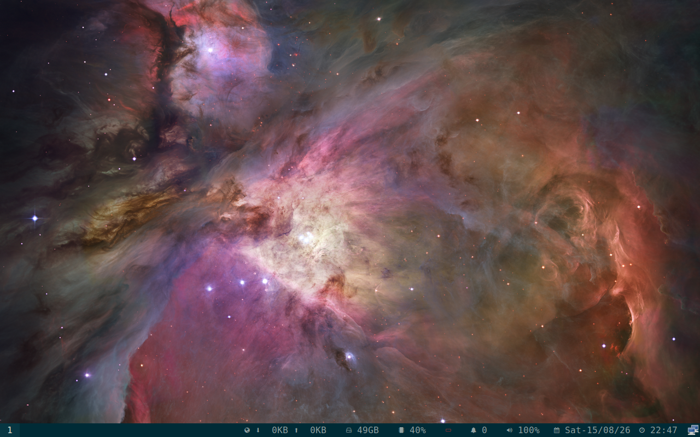

# Cosmolith generated-config persistence and cold-login proof

## Result

The current COSMIC-specific `cosmolith` branch was packaged, installed in a
disposable QEMU overlay, and tested through a cold reboot. A keyboard-layout
change in the COSMIC configuration was observed by `cosmolith`, written to
Regolith's generated Sway configuration, replayed after restarting the
packaged binary, and still applied after the reboot.

This is proof for one input setting in the Sway-backed Regolith session. It is
not a claim about the `cosmic-settings` GUI, native `cosmic-comp`, physical
hardware, or the complete display/settings matrix.

## Source and package references

- [`cosmolith` source branch](https://github.com/Rahul-2k4/cosmolith/tree/rahul/generated-config-persistence-20260814)
- [`cosmolith` source commit](https://github.com/Rahul-2k4/cosmolith/commit/4134034c10598e08c162a1c299690ba6ade948fc)
- [`regolith-inputd` source branch](https://github.com/Rahul-2k4/regolith-inputd/tree/rahul/inputd-cosmic-canonical-20260812)
- [`regolith-inputd` source commit](https://github.com/Rahul-2k4/regolith-inputd/commit/c658754ec10ac75422cba8e1c3517bba6075795f)

Packages installed in the overlay:

```text
cosmolith 0.1.0-1-1regolith-resolute
SHA-256: 88755b23cf938cbd58171e71b16b0456dc882100632dd6d02226694988a95ce3

regolith-inputd 0.4.1-2-1regolith-resolute
SHA-256: 52dfaba9617f046100ae0b32392662254e5411cc8d3c7c1265c57358e1901d34
```

## What was checked

1. The package pair was installed in a copy-on-write QEMU overlay.
2. A COSMIC keyboard-layout mutation was observed by `cosmolith` and written
   to `generated-config.d/input.conf` as an `xkb_layout fr` Sway directive.
3. After the live layout was temporarily changed, restarting the packaged
   `cosmolith` binary replayed the saved directive.
4. QEMU was cold-reset. A fresh graphical login reached the COSMIC/Sway
   desktop; Sway IPC reported the active keyboard layout as `French` and the
   generated directive remained present.
5. `cosmic-session`, Sway, `cosmolith`, and `regolith-inputd` were running;
   `dpkg --audit` and the failed-user-unit check were empty.



## Reproduction boundary

The mutation test exercises the COSMIC configuration watcher directly. It
does not pretend to be a successful `cosmic-settings` GUI test. The first
automated cold-login key sequence was rejected because the persisted French
layout changed raw key interpretation; a second layout-aware sequence reached
the desktop. That failed attempt is not counted as a pass.

One `swaymsg reload` attempt returned `Unable to receive IPC response`; the
accepted result is based on the explicit `cosmolith` restart and the cold
reboot query. The QEMU proof does not cover physical touchpad input,
multimedia keys, hotplug, mixed DPI, native `cosmic-comp`, or a full display
profile matrix.

## Proposal effect

This strengthens the evidence for criterion 7, "settings persist across
reboot," for one input setting. Criterion 7 remains `Partial` because the
broader proposal scope includes display and settings persistence. The strict
work-product status remains **62-68%** and **4/12 criteria fully met**.
