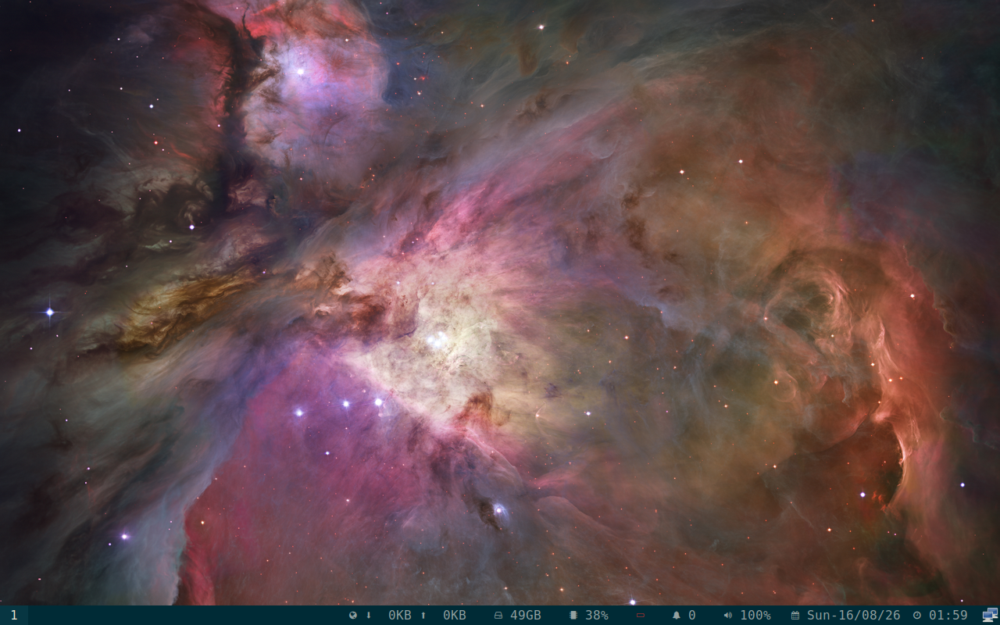

# Final displayd package QEMU runtime proof - 2026-08-16

This records the final Voulage-built displayd package after a cold boot in a
disposable QEMU overlay. The protected base image was not modified.

## Package

- Package: `regolith-displayd 0.3.4-1-1regolith-resolute`
- Package SHA-256: `ae5249b164cae2c65499b7b38b31bdea050bfe28f7ab753e0233e9a4dde1d3ad`
- Installed binary SHA-256: `d0a611e950f5cecc290cf59068bec368318e58866c38f06b37061e1636329458`

## Runtime result

The disposable guest reached the Regolith COSMIC session after boot:

- `cosmic-session` and Sway were running.
- Session type: `wayland`.
- `XDG_CURRENT_DESKTOP=Regolith-Wayland:COSMIC:sway`.
- `regolith-cosmic.target`: `active`.
- `regolith-init-displayd.service`: `active`, `ExecMainStatus=0`.
- `regolith-init-inputd.service`: `active`, `ExecMainStatus=0`.
- `regolith-init-cosmic-idle.service`: `active`, `ExecMainStatus=0`.
- `regolith-init-kanshi.service`: `inactive`; Kanshi remains GNOME-only.
- Sway IPC returned version `1.9` and reported output `Virtual-1`.

This is QEMU-only, single-output evidence. It does not cover physical
multi-display, hotplug, mixed DPI, touchpad hardware, native COSMIC Settings,
archive publication, or upstream acceptance. The strict status remains
`62-68%` and `4/12` fully met.
